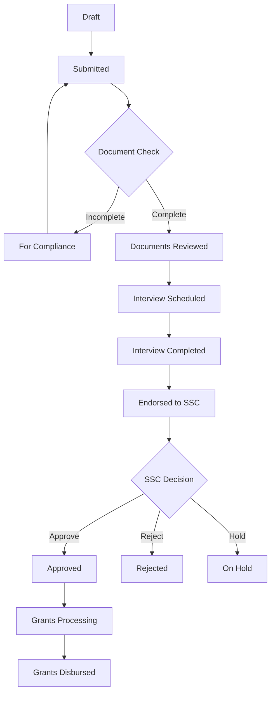

<!-- 53af6642-e8d5-4dfa-92a0-3fed218c3994 ca12b12b-5375-4376-bedd-13576554a0f0 -->
# Complete Scholarship Application System Workflow Documentation

## Overview

Document the entire scholarship application system workflow, including all stages, status transitions, components, and user interactions from start to finish.

## Documentation Structure

### 1. Create Main Workflow Documentation

**File**: `docs/SYSTEM_WORKFLOW.md`

Create comprehensive documentation covering:

#### Student Journey

- Registration process (citizen → student)
- Application creation and submission
- Document upload requirements
- Status tracking and notifications
- Interview participation
- Dashboard features

#### Admin Workflow

- Application review process
- Document verification
- Interview scheduling
- Evaluation review
- SSC endorsement process

#### SSC Workflow

- Final application review
- Approval/rejection decisions
- Policy compliance checks

#### Status Definitions

Complete list of all application statuses:

- `draft` - Application being created
- `submitted` - Application submitted for review
- `for_compliance` - Missing/incomplete documents
- `documents_reviewed` - Documents verified, ready for interview
- `interview_scheduled` - Interview date/time set
- `interview_completed` - Interview finished, awaiting endorsement
- `endorsed_to_ssc` - Endorsed for SSC final review
- `approved` - SSC approved
- `rejected` - Application rejected
- `on_hold` - Awaiting additional information
- `grants_processing` - Grant being processed
- `grants_disbursed` - Grant released to student

### 2. Create Component Mapping Documentation

**File**: `docs/COMPONENT_MAPPING.md`

Document which components handle which statuses:

#### Frontend Components

- `ScholarshipApplications.jsx` - handles: draft, submitted, for_compliance
- `InterviewSchedules.jsx` - handles: documents_reviewed, interview_scheduled
- `EndorseToSSC.jsx` - handles: interview_completed
- `SSC/ApplicationReview.jsx` - handles: endorsed_to_ssc
- `ScholarshipDashboard.tsx` - student view of all statuses

#### Backend Controllers

- `ScholarshipApplicationController.php` - main application logic
- `InterviewScheduleController.php` - interview management
- Status transition methods and validations

### 3. Create Status Transition Diagram

**File**: `docs/STATUS_FLOW_DIAGRAM.md`

Visual representation using Mermaid diagram:

### 4. Create API Endpoints Documentation

**File**: `docs/API_ENDPOINTS.md`

Document all API endpoints by workflow stage:

#### Application Management

- `POST /api/applications` - create application
- `GET /api/applications` - list applications
- `PUT /api/applications/{id}` - update application
- `POST /api/applications/{id}/submit` - submit application
- `POST /api/applications/{id}/review` - mark as reviewed

#### Interview Management

- `GET /api/interview-schedules` - list schedules
- `POST /api/applications/{id}/schedule-interview` - schedule interview
- `POST /api/applications/{id}/complete-interview` - submit evaluation

#### Endorsement & Approval

- `GET /api/applications/endorse-to-ssc` - get interview_completed apps
- `POST /api/applications/{id}/endorse-to-ssc` - endorse to SSC
- `GET /api/applications/endorsed-to-ssc` - get endorsed apps
- `POST /api/applications/{id}/approve` - SSC approve
- `POST /api/applications/{id}/reject` - reject application

### 5. Create User Role Permissions Documentation

**File**: `docs/USER_ROLES.md`

Document permissions for each role:

#### Citizen

- Register account
- Create/edit draft applications
- Submit applications
- Upload documents
- View own application status
- Join scheduled interviews

#### Admin/Staff

- View all applications
- Review documents
- Schedule interviews
- Conduct interviews
- Submit evaluations
- Endorse to SSC

#### SSC Members

- View endorsed applications
- Review interview evaluations
- Make final approval decisions
- Access reports and analytics

### 6. Create Interview Evaluation Documentation

**File**: `docs/INTERVIEW_EVALUATION.md`

Document evaluation process:

#### Evaluation Criteria

- Academic Motivation (1-5 scale)
- Leadership & Involvement (1-5 scale)
- Financial Need (1-5 scale)
- Character & Values (1-5 scale)
- Overall Recommendation (Recommended/Not Recommended/Conditional)
- Detailed Remarks

#### Scoring System

- Summary Score = Average of all criteria scores
- Scoring guidelines for each criterion
- Recommendation thresholds

#### Data Storage

- Stored as JSON in `interview_evaluation` field
- Summary score in `interview_summary_score` field
- Timestamp in `interview_completed_at` field

### 7. Update README Files

#### Main README

**File**: `README.md`

Add workflow overview section with links to detailed docs

#### GSM Frontend README

**File**: `GSM/README.md`

Add component documentation and routing information

#### Scholarship Service README

**File**: `microservices/scholarship_service/README.md`

Add API documentation and status management details

### 8. Create Developer Onboarding Guide

**File**: `docs/DEVELOPER_GUIDE.md`

Quick start guide for new developers:

- System architecture overview
- Key components and their purposes
- How to add new features
- Testing guidelines
- Common workflows to understand

## Documentation Format

All documentation should include:

- Clear headings and structure
- Code examples where applicable
- Visual diagrams (Mermaid)
- Links between related documents
- Last updated date
- Version information

## Benefits

- New developers can understand system quickly
- Clear reference for all stakeholders
- Easier maintenance and updates
- Better onboarding experience
- Reduced knowledge silos
- Foundation for user manuals

### To-dos

- [ ] Create database migrations for partner_school_enrollment_data table and update existing tables
- [ ] Create PartnerSchoolEnrollmentData model with relationships and scopes
- [ ] Create EnrollmentVerificationService for automatic verification logic
- [ ] Create CSVImportService for handling CSV file uploads and parsing
- [ ] Create PartnerSchoolEnrollmentController with upload, search, and management endpoints
- [ ] Update ScholarshipApplicationController to trigger automatic verification on review
- [ ] Add API routes for enrollment data management and verification
- [ ] Create enrollmentApiService.ts with methods for enrollment data operations
- [ ] Create EnrollmentDataUpload component for CSV file uploads
- [ ] Create EnrollmentDataManagement component for admin portal
- [ ] Update VerifiedEnrolledStudents to show auto-verification status and details
- [ ] Add notification methods for verification events
- [ ] Create enrollment.php config file with verification settings
- [ ] Create CSV format documentation and admin guide
- [ ] Create sample CSV files and unit tests for verification service