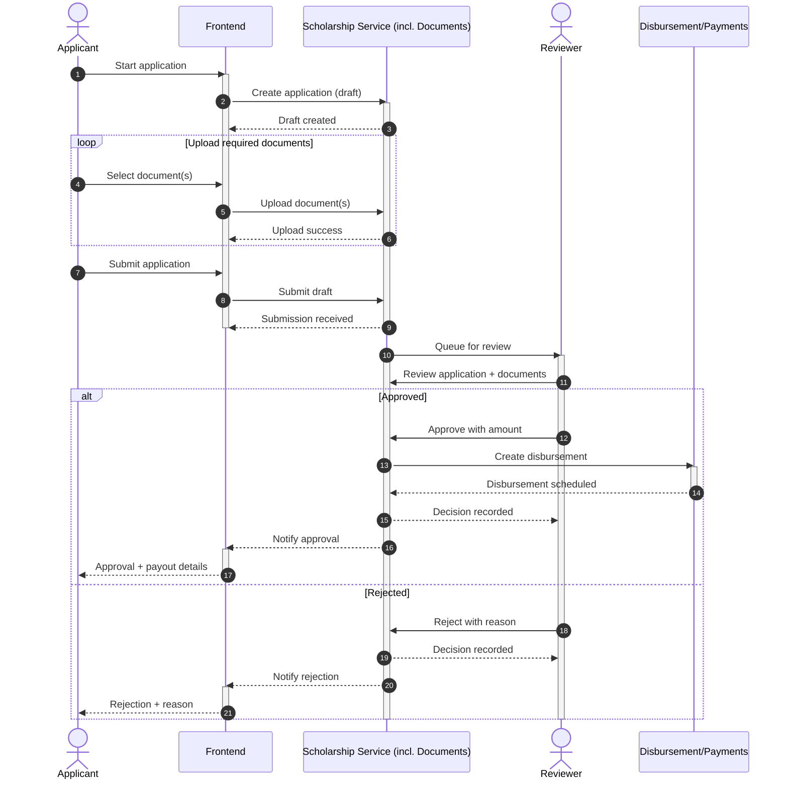

# Sequence Diagram Explanation: Scholarship Application Process

## Overview

This sequence diagram illustrates the complete workflow of a scholarship application system, from initial application submission through document upload, review, and final disbursement or rejection.

## Key Components

### Actors:

- **Applicant**: The individual applying for a scholarship
- **Reviewer**: The person responsible for evaluating and making decisions on applications

### System Participants:

- **Frontend**: The user interface layer that handles user interactions
- **Scholarship Service**: The core business logic service that manages applications and documents
- **Disbursement/Payments**: The financial service responsible for processing approved scholarship payments

## Process Flow Analysis

### Phase 1: Application Creation and Document Upload

1. **Application Initiation**: The applicant starts the application process through the frontend interface
2. **Draft Creation**: The frontend creates a draft application in the scholarship service
3. **Document Upload Loop**: The applicant iteratively uploads required documents, with each upload being processed and confirmed by the scholarship service
4. **Application Submission**: Once all documents are uploaded, the applicant submits the complete application

### Phase 2: Review Process

1. **Queue Management**: The scholarship service queues the submitted application for reviewer attention
2. **Review Activation**: Both the reviewer and scholarship service become active to handle the review process
3. **Application Evaluation**: The reviewer examines the application and associated documents

### Phase 3: Decision and Outcome Processing

## System Architecture and Roles

### Frontend Layer:

- Serves as the user interface gateway
- Handles user input and displays responses
- Manages the application workflow from the user's perspective
- Facilitates document upload and application submission

### Scholarship Service:

- Core business logic processor
- Manages application lifecycle (draft → submitted → reviewed)
- Handles document storage and validation
- Coordinates with other services for decision processing
- Maintains application state throughout the process

### Disbursement/Payments Service:

- Financial processing component
- Handles approved scholarship disbursements
- Manages payment scheduling and execution
- Provides confirmation of disbursement setup

## Decision Paths and Outcomes

### Approval Path:

1. **Decision**: Reviewer approves the application with a specified scholarship amount
2. **Financial Processing**: Scholarship service creates a disbursement record in the payments system
3. **Confirmation**: Payments service confirms the disbursement has been scheduled
4. **Notification Chain**:
   - Scholarship service records the approval decision
   - Frontend is notified of the approval
   - Applicant receives approval notification with payout details

### Rejection Path:

1. **Decision**: Reviewer rejects the application with a specific reason
2. **Record Keeping**: Scholarship service records the rejection decision
3. **Notification Chain**:
   - Frontend is notified of the rejection
   - Applicant receives rejection notification with the reason for denial

## Key Design Patterns

### Asynchronous Processing

The system uses activation/deactivation patterns to show when components are actively processing requests, allowing for efficient resource management.

### Event-Driven Architecture

The system relies on notifications and confirmations between services, enabling loose coupling and scalability.

### State Management

The application progresses through distinct states (draft → submitted → reviewed → approved/rejected), with each state having specific processing requirements.

### Error Handling

The alternative (alt) structure shows how the system handles both positive and negative outcomes gracefully.

## Business Value and Benefits

This sequence diagram represents a well-structured scholarship management system that:

- **Ensures Data Integrity**: Document uploads are validated and stored securely
- **Provides Transparency**: Clear communication flow keeps all parties informed
- **Enables Scalability**: Modular design allows for independent service scaling
- **Maintains Audit Trail**: All decisions and actions are recorded for compliance
- **Supports User Experience**: Intuitive workflow with clear feedback at each step

The system effectively separates concerns between user interface, business logic, and financial processing, making it maintainable and extensible for future enhancements.

## Sequence Diagram (Mermaid)

